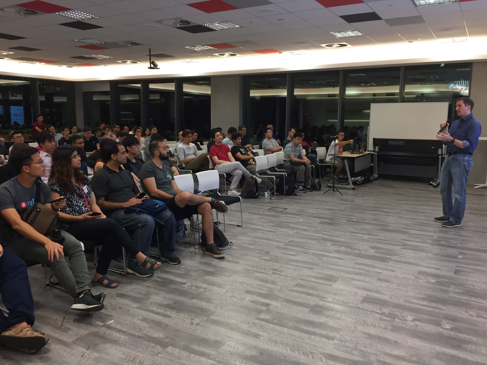
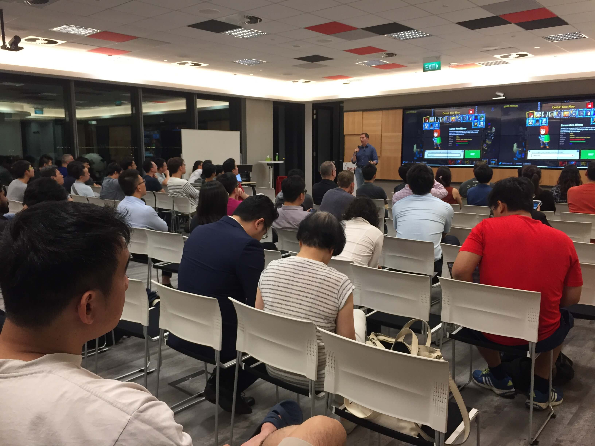
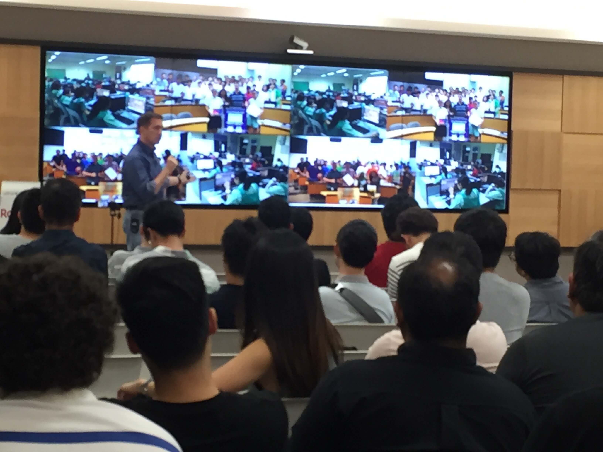

Speaking to a group of developers attending the monthly Talk.js meetup at downtown Viki Rakuten Office, Prof Boesch introduced them to ALSET's work in nurturing young coders through Game-based Learning. After describing the coding platform CodeCombat, he went on to share about how many students experience their first time writing code through CodeCombat.

Making sure to highlight the features of CodeCombat that enhances learners' experience such as character customisation and gradual build-up of concepts, Prof Boesch explains how students can start from zero and eventually attain a good mastery of coding concepts. At the same time, Prof Boesch also shared a number of personal anecdotes, winning the attention and applause from the audience.

Having tallied the performance of the students, the qualifying schools were then invited to send students to participate in the live Finals competition held at NUS. Prof Boesch shared his reflections and observations of the Finals event, leaving the audience feeling good about the exposure students get at the Finals and amazed at the progress these students have made.

Watch the video recording of the talk courtesy of Engineers.sg

<iframe width="560" height="315" src="https://www.youtube.com/embed/EEhkHUZ-wLE" frameborder="0" allow="accelerometer; autoplay; encrypted-media; gyroscope; picture-in-picture" allowfullscreen></iframe>

About the Author:  
_Shun works at the ALSET Translation Research Unit as a Research Assistant. Besides writing code in the day, he likes attending meetups and taking long walks._
