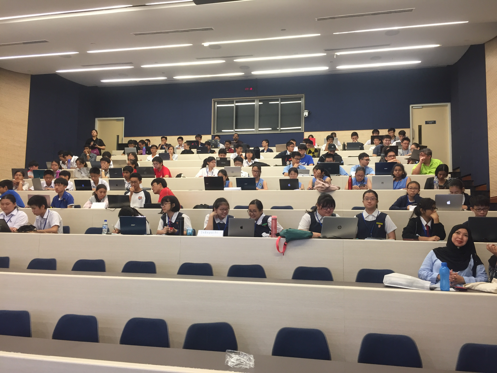
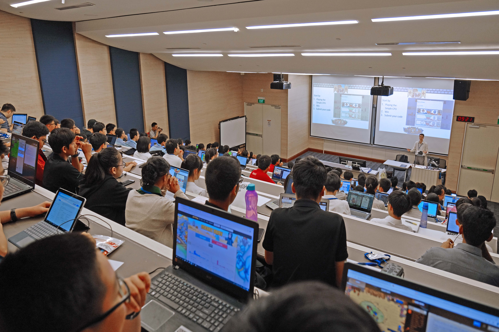
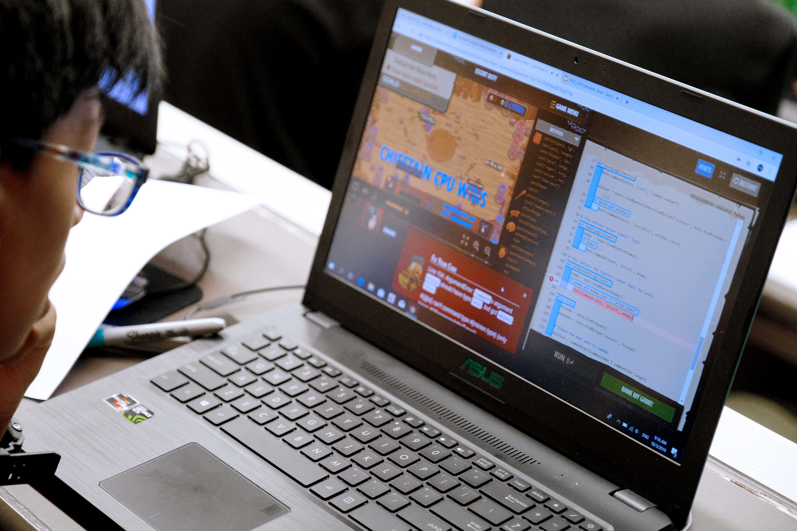
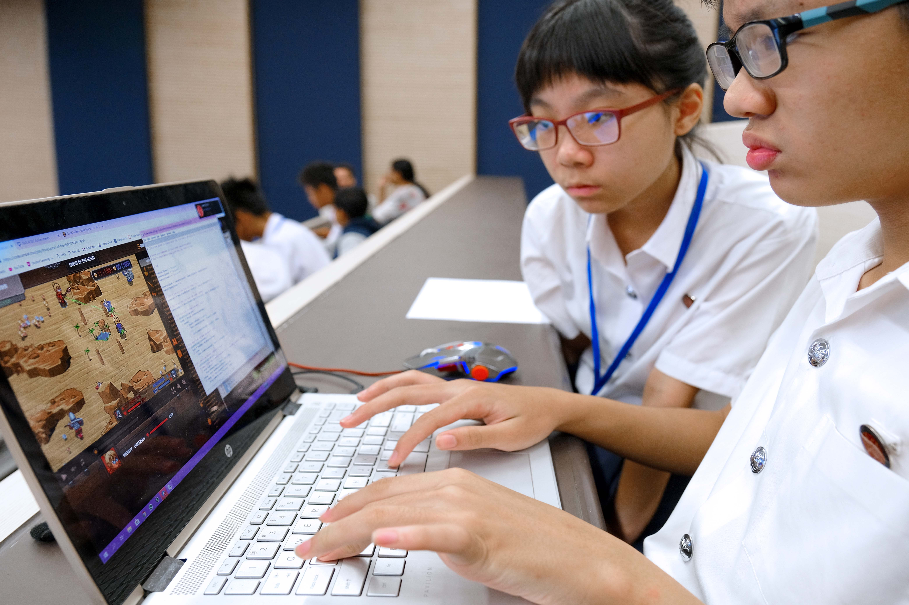
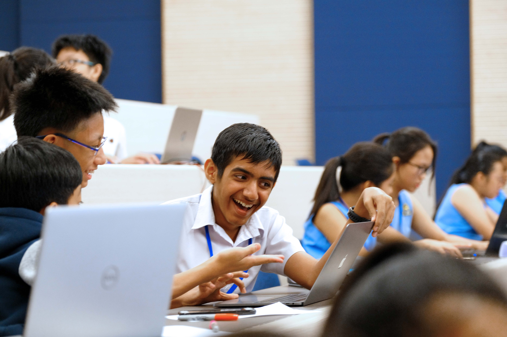
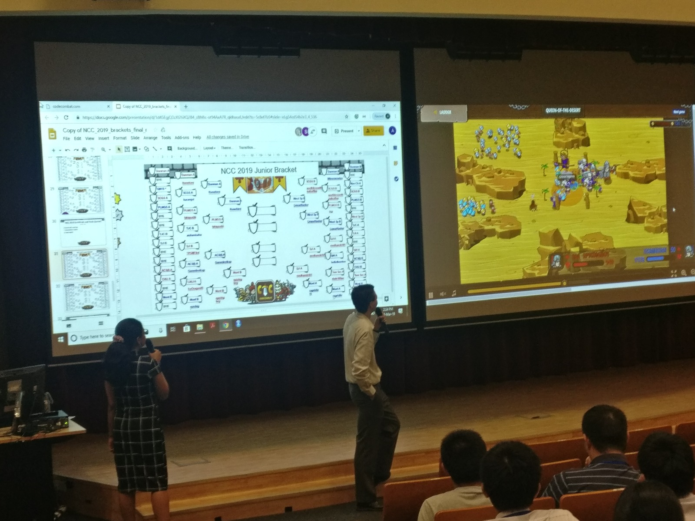
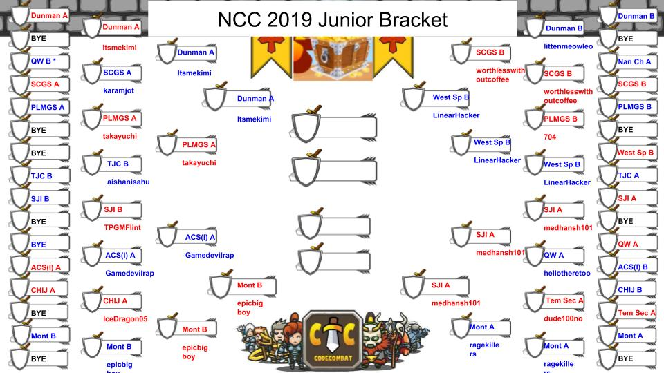
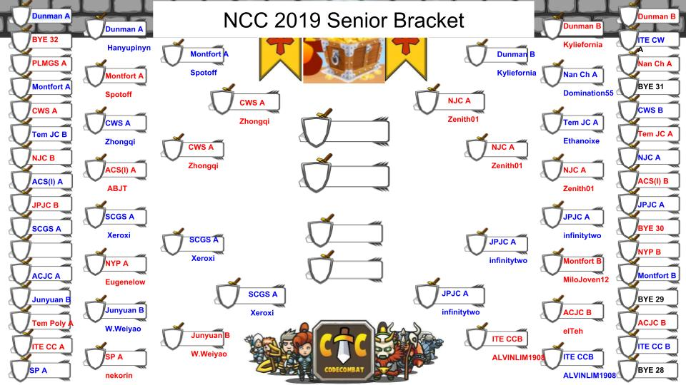
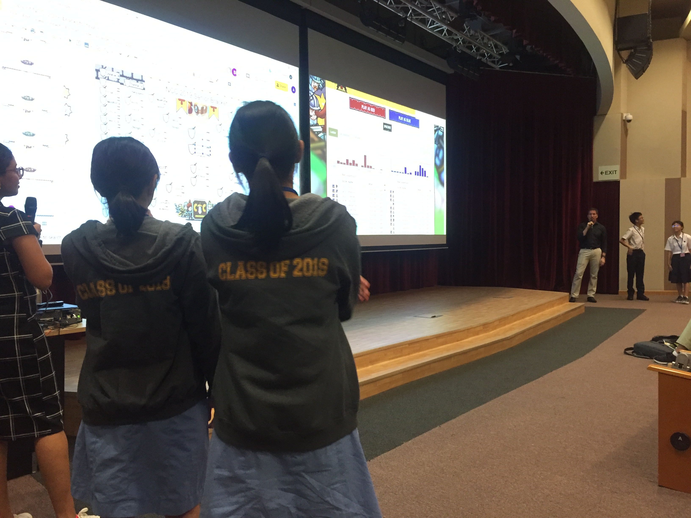

Coming to NUS UTown on the first day of their March holidays, 100 students representing their secondary schools, ITE colleges, junior colleges and polytechnics took part in the Finals of ALSET's 6th Annual National Coding Championships. Prior to the finals, 1280 students took part in the qualifying round. These students have been invited based on the effort they have put in to learn coding - facilitated through ALSET's achievements platform.

As the students settled in the lecture theatre for the introductory briefing by Kevin from ALSET, the atmosphere was filled with anticipation. Many of the students have in fact arrived early with their teachers. They were awaiting the unveiling of the CodeCombat multiplayer map that they will be coding on, for which they were given a time limit of 2 hours to come up with their best plan.

Combining all that they have learnt about either Python or Javascript programming language and the CodeCombat game engine, students had to plan and execute in code an overall strategy that should ideally work against all possible opponents rather than tailoring their approach to a single opponent because they did not know ahead of time who their opponents would be.

For those who are keen to know more, the students are applying agent-based programming where they wrote a program to command computer agents to take autonomous actions. The programmed agents competed on behalf of the students and without their control. As the matches unfolded, the students could only watch their programs perform by themselves without any further refinement.

The Queen of the Desert map specially designed for the competition was modelled of realtime strategy games Starcraft and Warcraft 3. Students had to include in their programs ways of balancing the gathering of resources, summoning of units, and engagement of their opponent.

Beyond the technical aspects, students had the opportunity to practice pair programming during their coding exercise in their teams of two. It was encouraging for us to note the spirited discussion, good humor and mutual encouragement between the team members throughout the exercise.

Two hours passed quickly. If not for the conversations taking place, it would almost feel like sitting for an exam as the participants maintained their concentration and focus throughout.

And then the knockout rounds began! Participants watch with excitement as each match was screened live - one match at a time. While every team can predict their units' next moves with certainty, the interplay between their code and their opponent's code contained a lot of surprises.

Watching their code perform in front of an audience of their peers was probably the first time for the students new to the NCC too. Regardless of the outcome, everyone cheered for the entertaining match and effort put in by their fellow participants.

Associate Professor Christopher Boesch, Deputy Director (Translational Research) at ALSET, conducted a sharing session midway. He highlighted that the outcome was less important than the process the students have embarked on, and that everyone present is a winner.

After two knockout rounds, the 50 teams (20 teams in the Junior category and 30 teams in the senior category) were reduced to two sets of 16 teams for the final rounds in the afternoon.

The atmosphere grew tenser and the tempo quicker as the quarter-finals and semi-finals were played - one game after another in close succession. There were at least two instances where teams made a comeback from the brink and a number of matches that went down to the wire - with the outcome in one match even decided by which side landed the final attack first!!!

And so it came down to the finals. Everyone watched with bated breath as the teams got through the early game gathering coins before their heroes and summoned units engage each other in a full-fledged melee towards the mid/late game.

On the Junior side, Team A from Dunman High School prevailed - having applied an effective resource gathering strategy and harnessed the ability of heavy combat units to make its way through the bracket.

, Kevin from ALSET, Dunman High School (Junior Category Champion), Saint Joseph's Institution (Junior Category Runner-up) & Jurong Pioneer Junior COllege (Senior Category Runner-up)")

On the Senior side, Team A from the Singapore Chinese Girls School emerged as the Champions. They have prioritised resource gathering while also making excellent use of their units' abilities - demonstrating both coding skill and strategy.

The finale of the National Coding Championships was the match between both the Junior Category Champions and the Senior Category Champions. While the team from Dunman High School started out strongly, the finely-tuned unit commands and well-timed strategy from the Singapore Chinese Girls School team tilted the balance in its favour.

All in all, the National Coding Championships are more about fostering a community of strategic problem solvers than determining who the best young coders in Singapore are. Every student received a Certificate of Achievement for being in the top 10% of qualifiers, but more importantly, every student got to spend the day discussing different aspects of an activity they were all interested in. They also got to see how their peers and seniors break down a complex problem into manageable parts. It was reassuring to us that the winning SCGS team had a student who has participated in previous NCC and Ace of Coders events with us. Each time her team competes, it adds a bit more nuance to its logic and sophistication to its strategies.

We were also featured on:

- [Instagram](https://www.instagram.com/p/BvLCrbKgEwJ/)
- [Facebook](https://www.facebook.com/nus.singapore/posts/10157053752213540)
- [Twitter](https://twitter.com/NUSingapore/status/1107821989966680064)

About the Author:  
_Shun works at the ALSET Translation Research Unit as a Research Assistant. Besides writing code in the day, he likes attending meetups and taking long walks._
