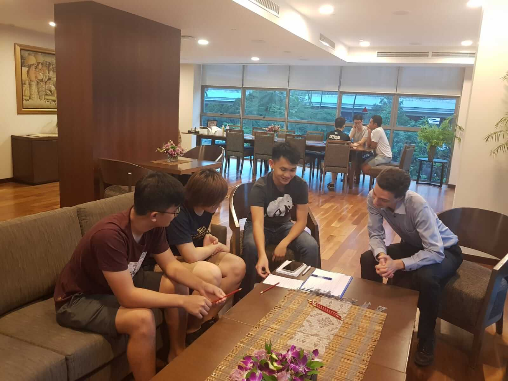
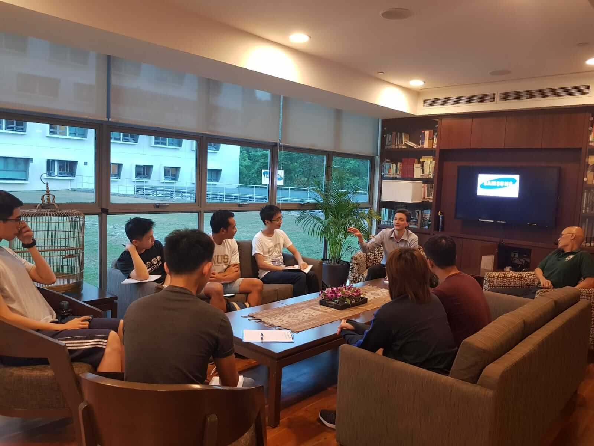
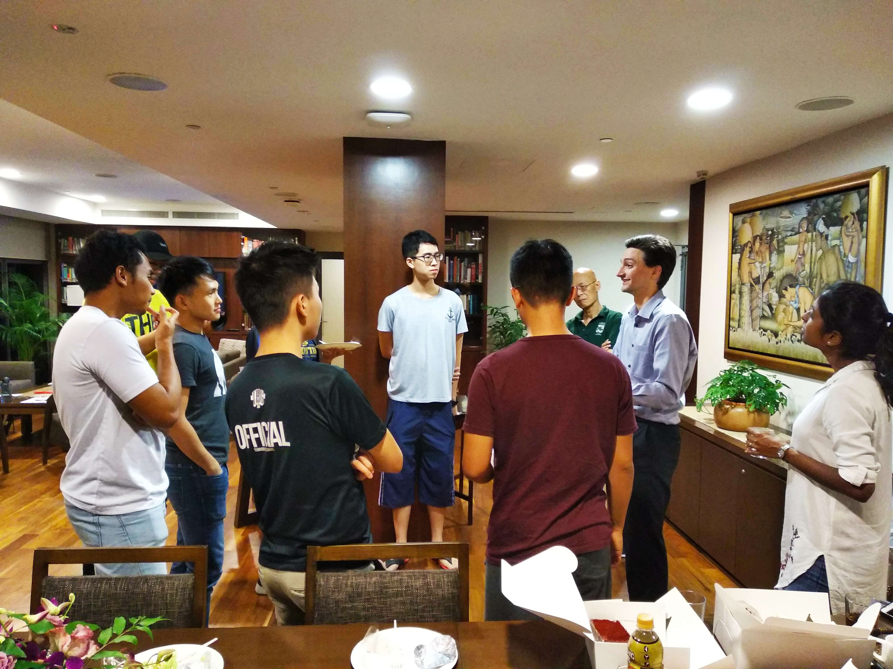
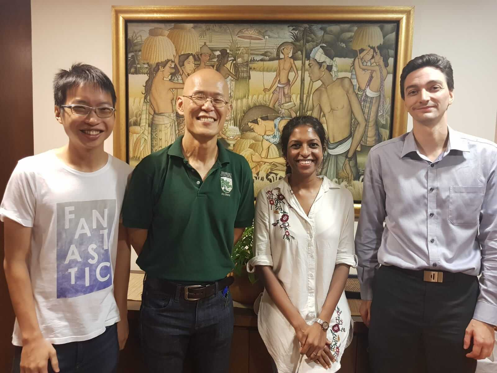

An evening of insightful coversation and lively activities took place as Prof Y.C. Tay hosted ALSET for Fellow's Tea at the cosy Master's Common Lounge in Tembusu College.

The attentive and inquiring Tembusians warmed up quickly to Mr Kevin Hartman, Translational Research Coordinator, as he describes how the 3 branches of ALSET work together in making a difference for the NUS community and Singapore.

 with Prof Tay (right)")

As the session continued, an engaging conversation took place around how the data stored within the ALSET Data Lake (ADL) can be used to help students surmount the challenges they face as NUS students.

Kevin emphasised that the synthetic data ALSET makes accessible to students only mimics the real data found in the ADL and is not real. However, the synthetic data is characteristic of the types of data NUS captures about its students. Accessing the synthetic data set places students in a good position to take action and find solutions to the challenges they encounter on campus. To demonstrate this, Kevin engaged the students in a quick data-driven decision making exercise.

With each group comprising a mix of students of different disciplines and ages, ideas flowed easily and they were soon able to come up with a list of challenges that affect their lives.

Next, the groups were asked to swap lists and each member had to individually rank both the frequency of encounters and importance of surmounting the challenges identified.

The room was filled with banter as group members discussed each item and clarified any ambiguities with the originating group. Some items brought about chuckles (eg. classes are too early!) while others raised interesting points (eg. lack of core modules to do while student is on internship).

Stretching the groups and their ideas further, Kevin asked each group to retrieve their list of challenges and analyse the ratings given to select one challenge and justify why they have selected it.

Having worked through the collected ratings and discussed about their selection criteria, one group decided to work on student fatigue while another decided to focus on time management.

They managed to conceptualise several solutions too - from publicising NUS PitStop to coordinating with faculty on finalising exam dates and assignment datelines in advance to address student fatigue to a checklist app that syncs with students' timetable and allows easy assignment of time blocks to tasks for time management.

Congratulations to both teams for their enthusiasm and effort in completing the data-driven decision making exercise!

Having had their interest piqued over the exercise earlier, the Tembusians were keen to learn more about ALSET and explore opportunities for collaboration over refreshments.

Relating back to the participants' experience earlier doing the exercise, Kevin shared that a number of students had worked with the synthetic version of the ALSET Data Lake and proposed good refinements such as aggregating study location information. He encouraged them to consider internships at ALSET where among other things, they can pursue ethnographic work or contribute to the codebase.

As the discussion progressed, the Tembusians gave ALSET valuable feedback. Prof Y.C. Tay shared about his research on Data Generation for Application-Specific Benchmarking that can help ALSET refine its Data Lake synthetic data set for NUS students to work on. The Tembusians also suggested several modules that ALSET data can be useful in. In addition, Kok Chung from Tembusu Tech also proposed linking up with ALSET.

All in all, it was a fruitful session with valuable takeaways for everyone in attendance. We are very grateful to Tembusu College and Prof Y.C. Tay for their support and look forward to future collaboration!

About the Author:  
_Shun works at the ALSET Translation Research Unit as a Research Assistant. Besides writing code in the day, he likes attending meetups and taking long walks._
