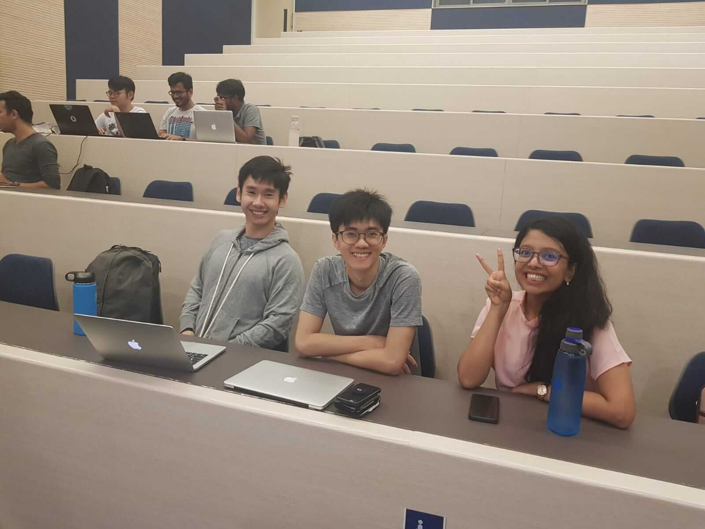
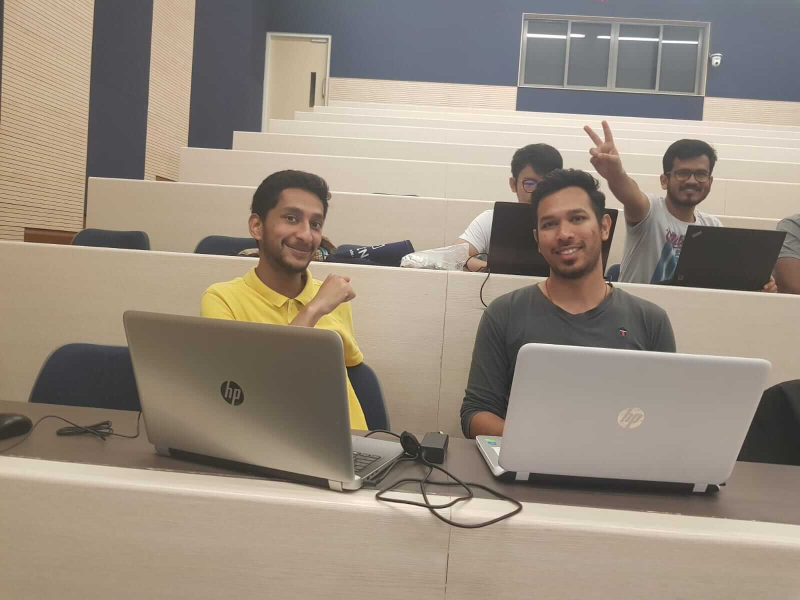

Putting data-driven decision-making into practice, 3 teams successfully completed ALSET's 3DM@NUS workshop on 25 February 2019 which was held at UTown and conducted by Mr Kevin Hartman. The outcome of the workshop was 3 testable prototypes designed to improve student life at NUS.

Data-driven decision-making relies on designers and developers being able to collect and analyse data when creating new products and systems. The focus of the workshop was to empower students to find and collect their own data to justify their design decisions.

<!--
 -->

The workshop was divided into 5 parts. During the first milestone, teams brainstormed as many challenges students at NUS face as they could. Beginning with their own personal experiences, the students bounced ideas off one another until they had generated a comprehensive list of challenges.

Next, each team sought to gain insights into their list of challenges by obtaining data on two key metrics (frequency of encounters and importance of surmounting the challenges identified). The source of this data was the team to their right. The point of the exercise was to show that data can come from anywhere and is easy to collect and analyse when you know what you are looking for.

Once they collected their own data, the teams were tasked with making sense of it. Sharing their thoughts with each other as they looked through the data, a few decision-making criteria stood out and they were soon able to narrow down their choices. The business analytics students settled on taking the mean and standard deviations of the data to pick a winner. The School of Computing students calculated the total score to rank the challenges from high to low. From there, they picked the one they like the most.

After the teams determined the challenge they would like to address, Kevin encouraged them to design an low resolution prototype that could be physically tested with volunteers. Low resolution prototypes do not require any coding or artistic talent. They are used to quickly test whether a brainstormed idea will work with the intended user. Using markers and paper, the teams sketched out a rough but usable user interface for their prototype - turning their thoughts into something others could interact with.

The completion of the prototypes led to testing them with real students. During the testing sessions, each team collected feedback about its prototype by trying it with a neighbor to its right. After watching and listening to their testers, the teams used the collected observational data to make their prototype more user-centered.

By the end of the workshop, teams had gone from thinking vaguely about the challenges students face to testing a possible solution and collecting data to evaluate its potential success. Because of their energy and determination, the teams managed to complete the milestones within 5 hours (including lunch).

With the promise of helping to take their ideas further, Kevin explained how AlSET's "challenges" are intended to empower students to take ownership of designing their own solutions. Addionally, ALSET supports students in forming Final Year Project ideas and creating internship opportunities that are meaningful to students.

As the workshop drew to a close, one important takeaway was how easy it was for students to make decision based on data than to decide themselves. Following on, ALSET plans on holding more advanced brainstorming and prototyping workshops in the future.

About the Author:  
_Shun works at the ALSET Translation Research Unit as a Research Assistant. Besides writing code in the day, he likes attending meetups and taking long walks._
