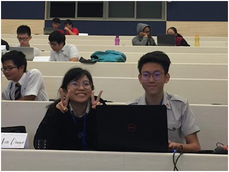
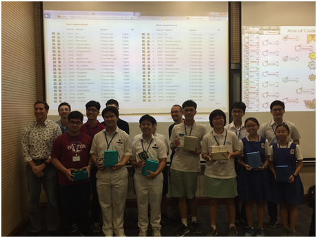

It could have been yet another lazy Saturday for me, if I had not volunteered to help the Translational Team of ALSET in organising the final day of the e-sport event, Ace of Coders 2018 at the Stephan Riady Centre, Utown. For a person like me who is a complete illiterate in digital literacy, it was going to be an experimental experience. Students and their parents had reached the venue much earlier than the scheduled time. I was told that these high school and junior college students were the shortlisted few from the online coding competition that was held through October 2018. They were all set to code their game, to decide the ultimate winner. Their energy and eagerness to code (or to game or to compete) was absolutely contagious. It was my extra caffeine shot to kick-start the day.

After the briefing of the programme schedule by Kevin Hartman, seniors and juniors were asked to be seated separately in lecture theatres LT50 and LT51. The students were asked to pair-programme using one computer (much to their surprise)! This was to encourage team spirit, support and tolerance. Once the arena was revealed, each team was given time until noon to develop the best possible algorithm to compete in the tournament to be held later in the afternoon. As I was floating around LT51 watching the juniors in action, I was struck by the high level of discipline and dedication the students showed. They do take the task in hand seriously!

While the students were all pumped up, the audience were not forgotten too. Or to say, parents, teachers and volunteers were turned into audience and kept entertained throughout the morning, as the students kept submitting their codes in-order to screen some random matches.

Things were running absolutely on time and we were on time for lunch at the touch of noon. Though Utown has really good and economical food courts and convenience stores to cater to the students and parents, it was a really considerate gesture of the organisers to serve lunch. Food is a common tongue which can convey the message of compassion towards fellow beings. I could see the kids, parents and organisers relishing themselves over the tasty, simple and complete lunch. After the relaxed lunch, there was still sometime for parents and kids (who were new to Utown), to stroll around the iconic town green area. In a way, it was a self-explanatory open house for Utown itself!

After the lunch break, we were back to work sharp at 1 pm. The submitted codes were made to compete with each other, to steer the teams towards deciding the ultimate winner! Chris Boesch and Sandra Boesch moderated the seniors’ team in LT50, while Kevin Hartman and Danny Whittaker moderated the juniors’ team in LT51. The matches were screened to give us all a completely exuberant experience.

Amongst the students, there was a mosaic of emotions ranging from embarrassment to pride. It gave the students a real life experience. It gave us a chance to observe how students react to any given situation. Students were sportive enough to handle success and failure in a ‘zen’ic way. Though there were mixed reactions all through the afternoon, excitement superseded and filled the air. I have not seen such ‘enthusiasm filled’ lecture theatres before. Even for a non-coder, I felt that the codes became increasingly competitive as the match timing increased towards the finals.

The final 3 teams from both the categories were asked to share their coding strategy, for the larger benefit of the students. Kevin Hartman had told me earlier that the winners from both the categories will be made to compete with each other over a friendly match. I was rather skeptical over the outcome of such a match, for, I thought it was unfair to make the juniors compete with seniors. To my surprise, the juniors beat the seniors, with their intelligent coding strategy. Hence proved- age is just a number.

The winners were rightly awarded and every student was rightly rewarded. The event ended much ahead of time, giving a whole Saturday evening for all of us to take home. The students and their parents (also a few teachers) had the opportunity to interact with ALSET team. New ideas and projects were proposed for the future. It gave us all an opportunity to improvise on ourselves and the event.

, Chris Boesch")

The whole day was to me a profound experience. From being a clueless (but willing) volunteer to understand what ALSET has to offer the world, I ended up gaining ‘never before’ insights about the world of data. That Saturday gave me too many ‘for-the-first-time-in-my-life’, moments. For a person completely ‘uninterested’ in gaming, the e-sport event gave me a fervently comfortable and engaging experience. I realised that, e-sports can cause the same adrenaline rush to the audience, as that of a physical sporting event. I realised the use and manipulation of data through coding, for the larger benefit of community. I understood the positive pedagogical change that ALSET was aiming to bring about through the right use of data. More than anything else, what was closer to my heart was that I saw an amazing gender equality. The number of female competitors was almost equal to that of their male counterparts. The faith that men and women can contribute equally to the growth of the country gives me a positive reassurance of the future.

Coding is the language of digital literature. In a country like Singapore where socio-economical growth is largely based on human resources, it becomes imperative for the future generation to acquire in-depth coding skills. Thus, on 10th November 2018, ALSET in association with Info-communications Media Development Authority (IMDA) successfully saw the short-listed high school and junior college teams coding their way to success through gaming. Through this e-sport, ALSET gets the satisfaction of making a difference in Singapore by helping ‘learners learn’, as their tagline goes. Studying the holistic behaviour of students while coding will help ALSET in their developmental projects for improving the quality and ease of education. ALSET’s Ace of Coders 2018 is definitely a brick in the wall of bringing about a pioneering difference in education in Singapore, inorder to set a global example.

About the Author:  _Viveka is a Postdoctoral Research Fellow in NUS. She wants her to be identified as an Avantgarde Scientist! She aspires to bridge academia and industry through the buzz words- technology, innovation, education & policy making. She is always open to discuss more on the same over a cup of coffee. On a lighter side, she is a fitness and travel freak, an intense reader and a light political observer._
